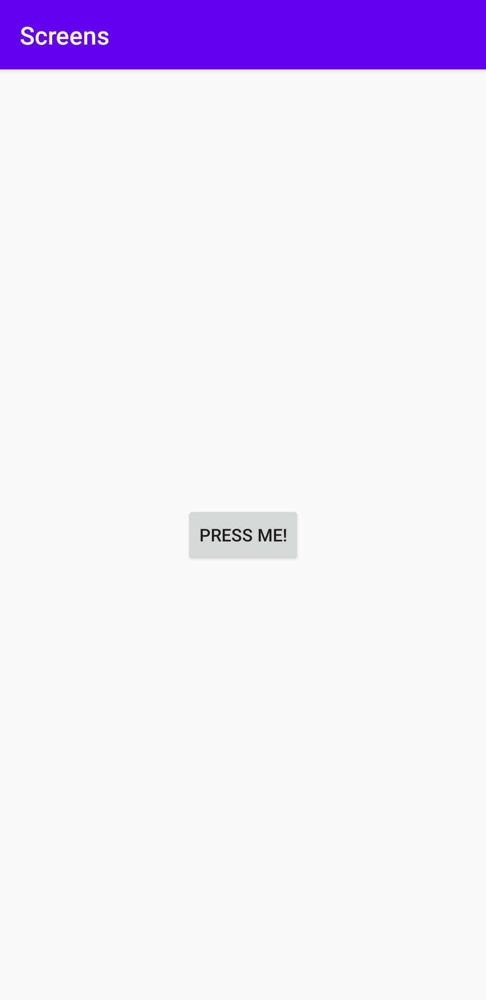
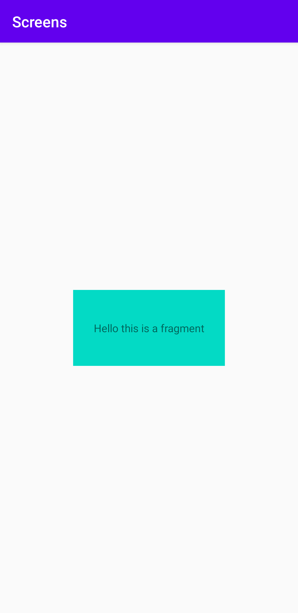

Rapport assignment 4 Screens

Kod och skärmdumpar




```
    <fragment
        android:name="com.example.screens.BlankFragment"
        android:layout_width="250dp"
        android:layout_height="250dp"
        android:tag="blank_fragment"
        app:layout_constraintBottom_toBottomOf="parent"
        app:layout_constraintEnd_toEndOf="parent"
        app:layout_constraintStart_toStartOf="parent"
        app:layout_constraintTop_toTopOf="parent" />
```

```
    <TextView
        android:background="@color/colorAccent"
        android:gravity="center"
        android:id="@+id/text_view"
        android:layout_width="200dp"
        android:layout_height="100dp"
        android:text="Hello this is a fragment"
        app:layout_constraintBottom_toBottomOf="parent"
        app:layout_constraintEnd_toEndOf="parent"
        app:layout_constraintStart_toStartOf="parent"
        app:layout_constraintTop_toTopOf="parent" />
```

Beskrivning av kod

Första kod exemplet är en fragment som jag har skapat i min andra activity, fragment innehåller först ett android name som pekar på java koden till mitt blank fragment.
Sen sätts höjden och bredden så jag kan få det precis som jag vill, efter det har fragment en tag och till sist alla constraint till "parent".
Det andra kod exemplet är en TextView som ligger i min blank fragment, först sätter jag en bakgrundsfärg för att se lättare hur stor TextView är och för att göra det snyggare än bara text på en tom sida.
Efter det sätts android:graviy till center för att lägga texten i mitten av TextView, sen sätts det ett id, en längd och en bredd.
Till lade jag till en text och alla fyra constraints till "parent".